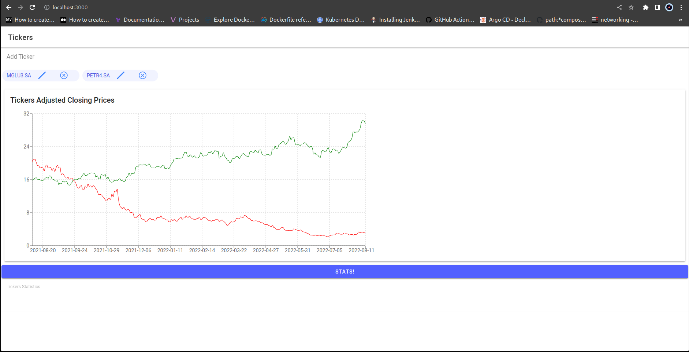
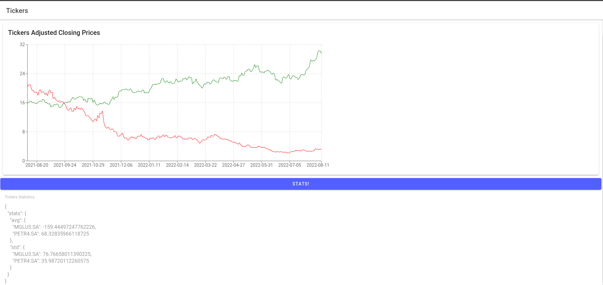

# Stock-Market-Ticker

Basic stock market ticker data analysis viewer based on python and typescript (usage of ionic framework).


## Demo




## Run Locally

Clone the project

```bash
  git clone https://github.com/vedant-204/stock-market-ticker
```

Go to the project directory

```bash
  cd stock-market-ticker
```

Run the container and build command.

```bash
  docker compose up --build 
```
or 

run Locally

```bash
  ./run.sh
```
## License

[MIT](https://choosealicense.com/licenses/mit/)


